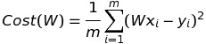
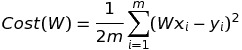
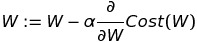

# ML/DL 스터디 메모

## ML 의 종류
- Supervised: training set(labeled examples)을 이용하여 학습시킨다.
- Unsupervised: training set 없이 학습시킨다.

## Superviced Learning 의 종류
- Regression: 특정 값을 예측
- Binary Classification: 두가지로 분류
- Multi-label Classification: 여러가지로 분류

## Linear Regression
### Hypothesis: 예측치가 Linear할 것 이다.
- H(x) = Wx + b
- Simplify => H(x) = Wx

### Cost(W, b): W, b가 주어졌을때 실제 데이터와의 오차치
- Simplify => Cost(W)
- 

### Convex function: 그래프를 그렸을 때, 볼록한 형태가 되는 함수
### Gradient Descent Algorithm: Convex function에서 minimize를 찾는 알고리즘
- 현재값을 다음값으로 변경할때 현재값의 접선을 따라가도록 한다. (미분 이용)

### Cost(W)는 convex function이 되기 때문에, gradient descent algorithm으로 minimize를 구할 수 있다.
- 는 learning rate인가보다. (constant)
- minimize를 구하는것이 목적이므로 /2를 해도 상관이 없다.
- 
- 
  - 
  - 
  - 
