# ML/DL 스터디 메모

## ML 의 종류
- Supervised: training set(labeled examples)을 이용하여 학습시킨다.
- Unsupervised: training set 없이 학습시킨다.

## Superviced Learning 의 종류
- Regression: 특정 값을 예측
- Binary Classification: 두가지로 분류
- Multi-label Classification: 여러가지로 분류

## Linear Regression
### Hypothesis: 예측치가 Linear할 것 이다.
- H(x) = Wx + b
- Simplify => H(x) = Wx

### Cost(W, b): W, b가 주어졌을때 실제 데이터와의 오차치
- Simplify => Cost(W)
- 

### Convex function: 그래프를 그렸을 때, 볼록한 형태가 되는 함수
### Gradient Descent Algorithm: Convex function에서 minimize를 찾는 알고리즘
- 현재값을 다음값으로 변경할때 현재값의 접선을 따라가도록 한다. (미분 이용)

### Cost(W)는 convex function이 되기 때문에, gradient descent algorithm으로 minimize를 구할 수 있다.
- 는 learning rate (constant)
- minimize를 구하는것이 목적이므로 /2를 해도 상관이 없다.
- 
- 
  - 
  - 
  - 

## Multi-variable Linear Regression
### linear regression에서 살짝 변형하면 됨
- 2개짜리: 
- n개짜리: 
- Cost function: 

### 수식이 너무 길어지니 matrix로 간편화
- 기본 발상: 
- 
- 
- 

## Logistic Classification
### Binary Classification: A or B 형태로 분류. 각각 0(fail), 1(pass)로 encoding해서 분류한다.

### 발상: linear regression으로 나온 그래프에서 반을 쪼개서 fail/pass 추측을 하면?
- training data에서 편차가 큰 input이 있으면 pass되어야할 데이터가 fail되도록 학습되는 문제점이 발생
- hypothesis의 결과값이 0~1범위를 많이 벗어나는 경우가 있음

### Logistic Hypothesis: 기존의 hypothesis의 결과값을 0~1사이로 제한
- logistic function(or sigmoid function): 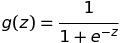
- hypothesis: 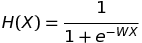

### Cost Function: 새로운 hypothesis의 결과값이 linear하지 않으므로(curved) 기존 cost함수를 사용하게 된다면 minimize를 구하기가 힘들어진다.
- 발상: using log
- new cost function for logistic: 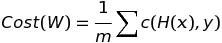
  - 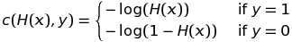
  - Simplify => 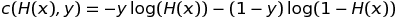

### Gradient Descent Algorithm
- 바뀐 cost함수를 그냥 적용
- 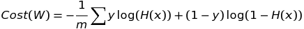
- 

## Softmax Regression
### Multinomial Classification: logistic classification 을 그대로 적용 가능
- 발상: 각각의 분류를 A or not, B or not 형식으로 분류하도록 하게 함
- hypothesis를 분류 수 만큼 만듬
  - 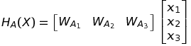
  - 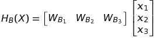
  - 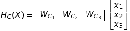
- 하나로 묶어서 간단하게 표현하자
  - 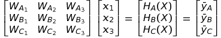
- 하지만 이러면 각각의 결과값이 0~1 범위를 벗어나 버린다. 결과값에 softmax function을 적용해서 해결.

### Softmax function: 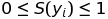와 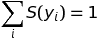를 만족하는 function
- 결과값이 확률처럼 표현이 되는데, 우리는 분류를 해야하므로 one-hot encoding을 해줌.
- one-hot encoding: softmax function의 result 중에서 제일 높은 수치를 1.0, 나머지를 0.0으로 만듬

### Cross-entropy Cost Function
- softmax function과 one-hot encoding의 결과를 함수화해서 표현
  - 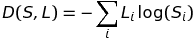
  - 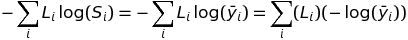
- 사실은 logistic cost function과 cross entropy cost function은 동일하다.
- 최종적인 cost function의 형태: 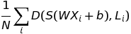

### Gradient Descent Algorithm
- 언제나 그렇듯이 cost function을 미분한뒤 learning rate만큼 쫒아가도록 한다.
- TODO: 미분 과정

## Machine Learning Tips
### Learning Rate
- large learning rate: overshooting
- small learning rate: takes too long, stops at local minimum
- observe the cost function for solve: learning rate의 시작을 0.01로 두고 cost function의 값을 관찰하며 수정해나가면 좋다

### Data Preprocessing
- gradient descent를 적용하기 위해 X 데이터를 때때로 전처리 해줘야함
  - zero-centered data: 데이터 분포의 중심점을 zero로 맞춤
  - normalized data: 데이터 전체 범위를 특정 범위로 normalize
    - Standardization: 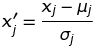 (X_std[:,0] = (X[:,0] - X[:,0].mean()) / X[:,0].std())

### Overfitting: 너무 training set에 맞춰버려서 training data 외의 데이터 적중률이 떨어지는 문제
- solutions for overfitting
  - more training data
  - reduce the number of features
  - Regularization: 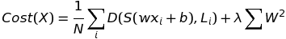
    - 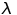 는 regularization strength (상수)

### Learning and test data sets
- 구성: Original Set = Training Set + Validation Set + Testing Set
  - validation은 learning rate나 regularization strength 등을 조정하며 테스트시 사용
  - train 후 validation 통과하면 test

